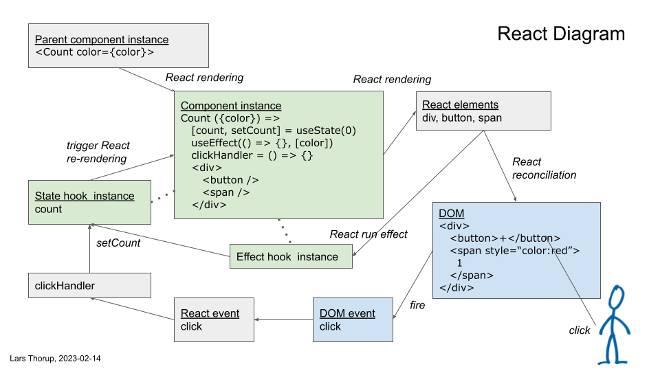
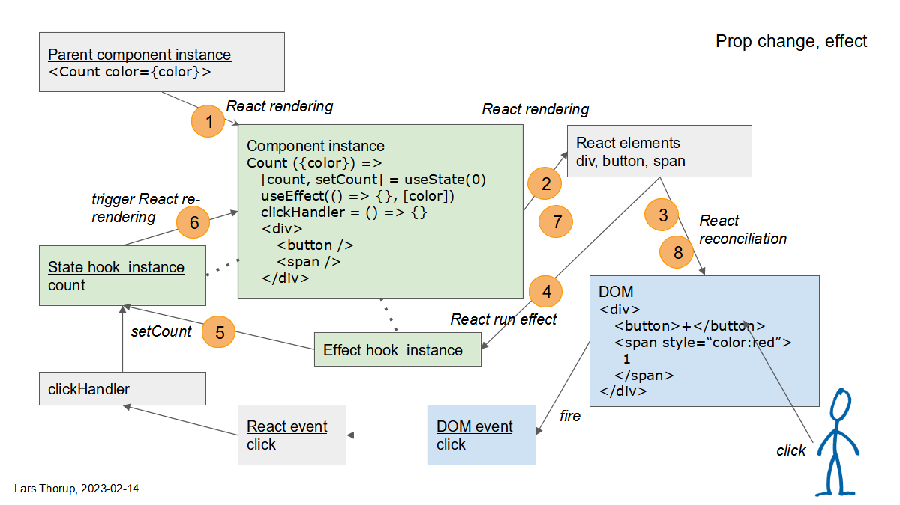

# react-diagram

This diagram illustrates how React schedules: mounting, rendering, reconciliation, event handling and effects.

```
npm install
npm run dev
```

Code is in [App.tsx](./src/App.tsx).

## Overview



- Green means Count component and hook instances
- Blue means DOM
- Grey is everything else

## Initial rendering, mounting

1. Parent renders
2. Component instance created
3. State hook instance created with initial value 0
4. Effect hook instance created
5. React elements for component created
6. DOM elements created to show "0" as black (default color)
7. React runs the effect hook initially
8. Effect hook call setState to set counter to 0 - same as it already is


## User click, state change

1. User clicks on botton in browser window
2. DOM fire a click event
3. React wraps DOM event in a React event
4. React dispatches React event to clickHandler function
5. clickHandler function call setState to increment counter to 1
6. React triggers a re-rendering of the component
7. React elements for component re-rendered
8. React reconciles DOM elements with the re-rendered React elements to show "1"


## Prop change, effect

1. Parent component re-renders the component with color prop updated to "red"
2. React elements for component re-rendered
3. React reconciles DOM elements with the re-rendered React elements to style the span as "red"
4. React runs the effect hook because the color dependency has changed
5. Effect hook call setState to reset counter to 0
6. React triggers a re-rendering of the component
7. React elements for component re-rendered
8. React reconciles DOM elements with the re-rendered React elements to show "0"


